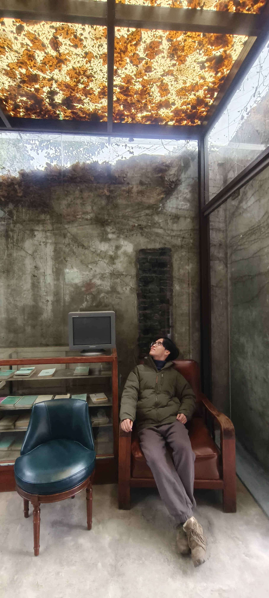

# About Me

Here is **Hanyang Zhong (Hanyang, 钟翰扬)**.

I am a second-year PhD candidate in the School of Electronic Engineering at the University of York in the UK. My research interests encompass Large Language Models, Multi-modality, 3D Reconstruction, SLAM and Embodied AI. I am currently conducting doctoral research under the supervision of Professor Mark Post, investigating the integration of large language models with robots and Multi-agent SLAM system.  

My background includes experience as a researcher in Professor Post's lab at York, where my focus has been on advancing the state-of-the-art in language model capabilities for robotic platforms. I have a passion for interdisciplinary research that bridges LLM, Embodied AI, and 3D Reconstruction. 

I would be delighted to discuss potential collaborations or my research in more detail. Please feel free to email me if you would like to connect further (hanyang.zhong@york.ac.uk).

---

## Academic Background

**[Highlight] I am looking for postdoctoral research to start in 2025 Fall. Contact me if you have any leads!**

- **Sep 2021 - June 2022:** University of York (MSc)
- **Sep 2022 - Now:** University of York (Phd)

I am currently pursuing a PhD. Upon successful PhD completion, I hope to obtain postdoctoral research opportunities in academia or industry. My goal is to excel in my doctoral studies to be competitive for quality postdoc positions related to my expertise.

 

---

## Research Interests

- Large language models (LLM)
- Multi-modality
- 3D Reconstruction
- SLAM
- AI Agent
- Robotics
- Embodied AI

My research centers on advancing **Embodied AI** by integrating large language models with **Robotic** platforms, investigating how a robot's grounded **Multi-modality** experiences may enrich and enhance the knowledge and inferences of a language model.

 

---

## News and Updates

- **July 2024：** The [ICME 2024](https://2024.ieeeicme.org/#/) was perfectly held, and our papers (Camera Ready Version of *[LLM-SAP](https://vista-h.github.io/MML4SG_2024/papers/wang2024llm.pdf) and FENet*) were perfectly exhibited at the conference. Welcome to continue following our work.
- **April 2024：** Our work *LLM-SAP: Large Language Models Situational Awareness Based Planning* has been accepted to [ICMEW 2024](https://vista-h.github.io/MML4SG_2024/#/) . See you in Canada! [Preprint version download](https://arxiv.org/abs/2312.16127#/)🔗
- **March 2024：** Our work *FENet: Focusing Enhanced Network for Lane Detection* has been accepted to [ICME 2024](https://2024.ieeeicme.org/#/) as an Oral paper. See you in Canada! [Preprint version download](https://arxiv.org/abs/2312.17163#/)🔗
- **Jan 2024:** Becoming an **ICME reviewer**!
- **Dec 2023:** I posted a preprint on arXiv titled "[**LLM-SAP: Large Language Model Situational Awareness Based Planning**](https://github.com/HanyangZhong/Situational_Planning_datasets)" exploring the use of LLMs to enable context-aware robot planning. I welcome constructive feedback, related perspectives, and relevant citations from the community as I continue developing these ideas at the intersection of language models, robotics, and embodied intelligence. Please reach out if you see potential connections to your own research - I believe open collaboration can advance this emerging field.
- **Dec 2023:** I posted the preprint "[**FENet: Focusing Enhanced Network for Lane Detection**](https://github.com/HanyangZhong/FENet)" on arXiv. This paper proposes a novel neural network approach to improve lane detection capabilities in autonomous driving. I welcome constructive feedback, relevant perspectives, and citations from the community as I continue refining this method. Please reach out if you see potential connections to your own work at the intersection of computer vision and autonomous systems - open collaboration can advance this important field.

 
