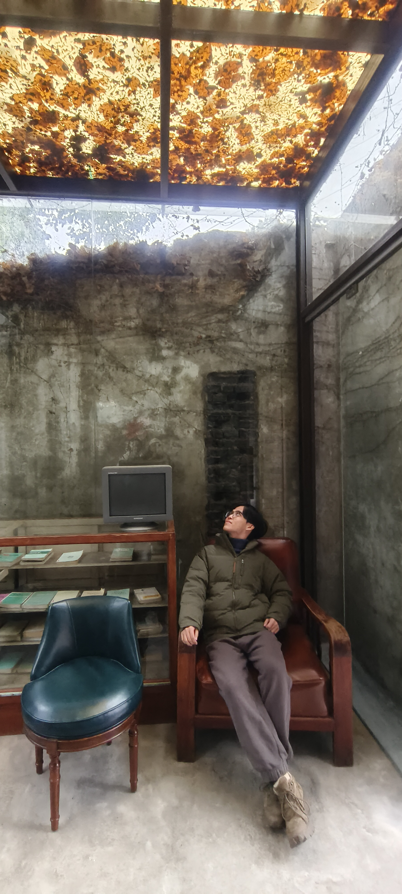

# About Me

I am **Hanyang Zhong (钟翰扬)**, a PhD candidate in Electronic Engineering at the University of York, UK, supervised by Professor Mark Post.

I work on robotics and embodied AI, with recent projects focusing on real-world robotic systems and manipulation tasks. My research combines system development, robot learning, and multimodal sensing, aiming to build reliable robotic platforms that can operate under complex physical interactions.

I have been involved in projects spanning contact-rich manipulation, dexterous robotic hands, teleoperation systems, SLAM, and LLM/MLLM-based robotic reasoning.

I am open to collaborations and research opportunities in robotics, embodied AI, and robot learning.

📧 hanyang.zhong@york.ac.uk

---

## Academic Background

**[Highlight] I am looking for postdoctoral research opportunities starting in Fall 2026 in robotic manipulation, contact-rich manipulation, robot learning, dexterous robotics, and embodied AI. Please feel free to contact me if you have any leads!**

- **Sep 2021 - June 2022:** University of York (MSc)
- **Sep 2022 - Sep 2026** University of York (PhD)

I am currently pursuing a PhD in Electronic Engineering at the University of York. Upon successful completion of my PhD, I hope to continue my research career as a postdoctoral researcher in academia or industry. I am particularly interested in positions related to contact-rich robotic manipulation, dexterous hands, tactile/force sensing, imitation learning, multimodal robotic systems, and embodied AI.
 

---

## Research Interests

My research interests center on **contact-rich robotic manipulation** and **embodied AI**.

I am particularly interested in how robots can interact robustly with objects under complex contact conditions, such as adhesion, insertion, occlusion, friction, deformation, and hidden force constraints.

Current research topics include:

- Contact-rich manipulation
- Dexterous manipulation
- Force-aware robot learning
- Bimanual manipulation
- Teleoperation and robot data collection
- Imitation learning / learning from demonstration
- Tactile and visuotactile perception
- Multimodal robotic systems
- Vision-Language-Action models
- Embodied AI and foundation models for robotics
- SLAM and spatial intelligence for robotics

 

---

## Publications and Preprints

- **StrucLine-SLAM: A Lightweight and Fully Geometric SLAM System for Structure-Dominant Environments**  
  **Hanyang Zhong**, Liman Wang, Mark Post  
  *Under review, Preprint, 2026*  
  This work presents a line-centric stereo SLAM system designed for structure-dominant and low-texture environments. It uses line features as primary geometric cues to improve localization and mapping robustness in scenes such as corridors, workshops, photovoltaic fields, and other man-made environments. The system aims to provide a lightweight and fully geometric alternative for reliable robotic mapping without relying on learning-based components.

- **MLLM-Fabric: Multimodal Large Language Model-Driven Robotic Framework for Fabric Sorting and Selection**  
  Liman Wang, **Hanyang Zhong**, Tianyuan Wang, Shan Luo, Jihong Zhu  
  *IEEE Robotics and Automation Letters (RA-L), 2025*  
  This work proposes a robotic framework for fabric sorting and selection using multimodal large language models. The system integrates RGB images, tactile sensing, and pressure data to reason about material properties such as softness, elasticity, and thickness. It demonstrates how MLLMs can support task-aware robotic decision-making for deformable material handling and textile-related applications.

- **Balancing Rigor and Utility: Mitigating Cognitive Biases in Large Language Models for Multiple-Choice Questions**  
  **Hanyang Zhong**, Liman Wang, Wenting Cao, Zeyuan Sun  
  *CogSci 2025*  
  This work investigates how cognitive biases affect the decision-making behavior of large language models in multiple-choice reasoning tasks. Instead of simply attempting to remove all biases, it studies how abstention and bias-aware prompting can balance accuracy, decisiveness, and reliability. The work provides insights into building more trustworthy LLM-based reasoning systems under uncertainty.

- **FENet: Focusing Enhanced Network for Lane Detection**  
  **Hanyang Zhong**, Liman Wang  
  *IEEE ICME 2024, Oral*  
  This work proposes a focusing enhanced network for robust lane detection in autonomous driving scenarios. The method improves the representation of lane-related visual features, especially under challenging road conditions where lane markings may be weak, occluded, or visually ambiguous. It contributes to perception systems for intelligent transportation and autonomous driving.

- **LLM-SAP: Large Language Models Situational Awareness-Based Planning**  
  **Hanyang Zhong**, Liman Wang  
  *IEEE ICME Workshops, 2024*  
  This work explores how large language models can be used for situational-awareness-based robotic planning. The framework encourages robots to consider environmental context, task constraints, and safety-related information before generating actions. It represents an early step toward using LLMs as high-level reasoning modules for embodied robotic decision-making.

---

## News and Updates

- **Upcoming (June 2026):** I will attend [**ICRA 2026**](https://2026.ieee-icra.org/) to present our *MLLM-Fabric* poster. Looking forward to discussing our recent work on multimodal robotic manipulation, tactile sensing, and embodied AI with the robotics community.

- **May 2026:** I participated in the [**Institute for Safe Autonomy (ISA) Industry Summit and Open Day**](https://www.linkedin.com/posts/yesterday-we-hosted-our-first-safe-autonomy-ugcPost-7458152703320420352-D3Aw?utm_source=share&utm_medium=member_desktop&rcm=ACoAAAOr9DUB6aB17yx2UhkaK1uoeustSxi0iJE) at the University of York. It was a great opportunity to present and discuss our recent robotics research with visitors from academia and industry, especially around safe autonomy, embodied AI, and robotic manipulation.

- **May 2026:** I became a reviewer for [**CoRL 2026**](https://www.corl.org/), the Conference on Robot Learning, which focuses on the intersection of robotics and machine learning. CoRL 2026 will be held in Austin, Texas, US. I am excited to contribute to the robot learning and embodied AI research community through the reviewing process.

- **March - May 2026:** I continue serving as a reviewer for **Complex & Intelligent Systems (CAIS/CIS)**. I appreciate the opportunity to review work related to intelligent systems, AI, and robotics.

- **March 2026:** Our work *StrucLine-SLAM: A Lightweight and Fully Geometric SLAM System for Structure-Dominant Environments* is currently under review. We propose a line-centric stereo SLAM system for structured and low-texture environments such as corridors, workshops, and photovoltaic fields. This work aims to provide a lightweight geometric mapping solution for robotic systems operating in structure-dominant scenes.

  - [Preprint](https://papers.ssrn.com/sol3/papers.cfm?abstract_id=6506801) 🔗
  - [Project Website](https://anonymous.4open.science/r/SLAM-C7BA/README.md) 🔗
  - [Video](https://www.youtube.com/watch?v=MN1LQOo9EvI) 🔗

- **March 2026:** I became a reviewer for [**IROS 2026**](https://2026.ieee-iros.org/), the IEEE/RSJ International Conference on Intelligent Robots and Systems. IROS 2026 will be held in Pittsburgh, Pennsylvania, USA, focusing on intelligent robots, autonomous systems, robot learning, and embodied AI. I am happy to contribute to the robotics research community through the reviewing process.

- **Oct 2025:** Our work *MLLM-Fabric: Multimodal Large Language Model-Driven Robotic Framework for Fabric Sorting and Selection* has been accepted to **IEEE Robotics and Automation Letters (RA-L)**. We propose a multimodal robotic framework that combines RGB images, tactile sensing, pressure data, and MLLM-based reasoning for fabric sorting and selection. This work explores how multimodal foundation models can support task-aware robotic manipulation of deformable materials.

  - [Paper](https://ieeexplore.ieee.org/abstract/document/11217170) 🔗
  - [Project Website](https://github.com/limanwang/MLLM-Fabric) 🔗
  - [Dataset](https://huggingface.co/datasets/EuniceF/MLLM-Fabric) 🔗

- **July 2025:** Our work *Balancing Rigor and Utility: Mitigating Cognitive Biases in Large Language Models for Multiple-Choice Questions* has been accepted to [**CogSci 2025**](https://cognitivesciencesociety.org/cogsci-2025/). We propose an abstention-aware evaluation and prompting framework to study how cognitive biases affect LLM reasoning under uncertainty, aiming to improve the reliability and practical utility of LLM-based decision-making systems. The paper, dataset, benchmark website, and poster are publicly available.

  - [Paper](https://escholarship.org/uc/item/2vr690cx) 🔗
  - [Dataset](https://github.com/HanyangZhong/BRU-datasets) 🔗
  - [Project Website](https://hanyangzhong.github.io/BRU-website/) 🔗
  - [Poster](https://github.com/HanyangZhong/BRU-website/blob/main/src/assets/font/CogSci_BRU_Poster.pdf) 🔗

- **July 2024:** The [**ICME 2024**](https://2024.ieeeicme.org/#/) was successfully held, and our papers (*LLM-SAP* and *FENet*) were presented at the conference. Welcome to continue following our work.

- **April 2024:** Our work *LLM-SAP: Large Language Models Situational Awareness Based Planning* has been accepted to [ICMEW 2024](https://vista-h.github.io/MML4SG_2024/#/). We propose a situational-awareness-based planning framework that uses LLMs to support safer and more context-aware robotic decision-making. [Preprint version download](https://arxiv.org/abs/2312.16127#/) 🔗

- **March 2024:** Our work *FENet: Focusing Enhanced Network for Lane Detection* has been accepted to [ICME 2024](https://2024.ieeeicme.org/#/) as an Oral paper. We propose a focusing enhanced network to improve lane feature representation and robust lane detection in autonomous driving scenarios. [Preprint version download](https://arxiv.org/abs/2312.17163#/) 🔗

- **Jan 2024:** Became an **ICME reviewer**.

- **Dec 2023:** I posted a preprint on arXiv titled "[**LLM-SAP: Large Language Model Situational Awareness Based Planning**](https://github.com/HanyangZhong/Situational_Planning_datasets)". We explore the use of LLMs to enable context-aware robot planning and situational reasoning.

- **Dec 2023:** I posted the preprint "[**FENet: Focusing Enhanced Network for Lane Detection**](https://github.com/HanyangZhong/FENet)". We propose a neural network approach to improve lane detection for autonomous driving perception.

 
